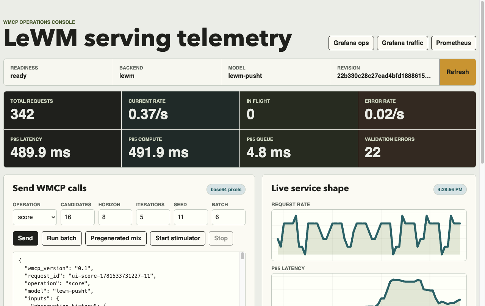
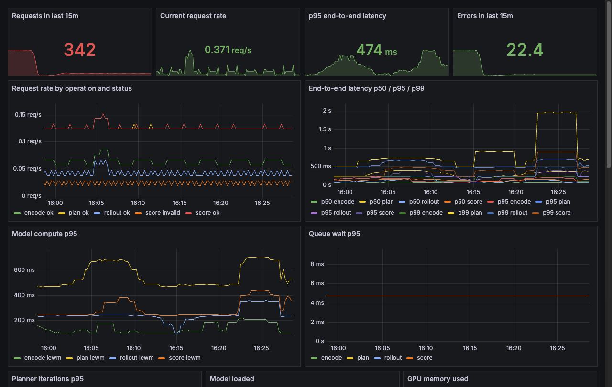
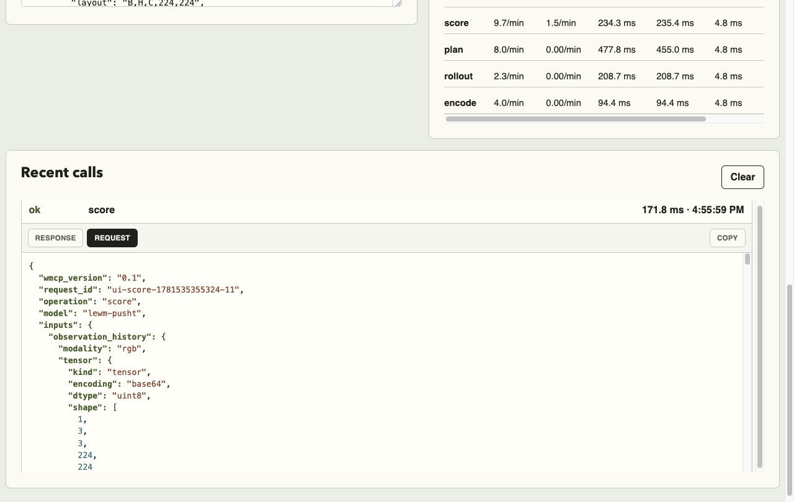
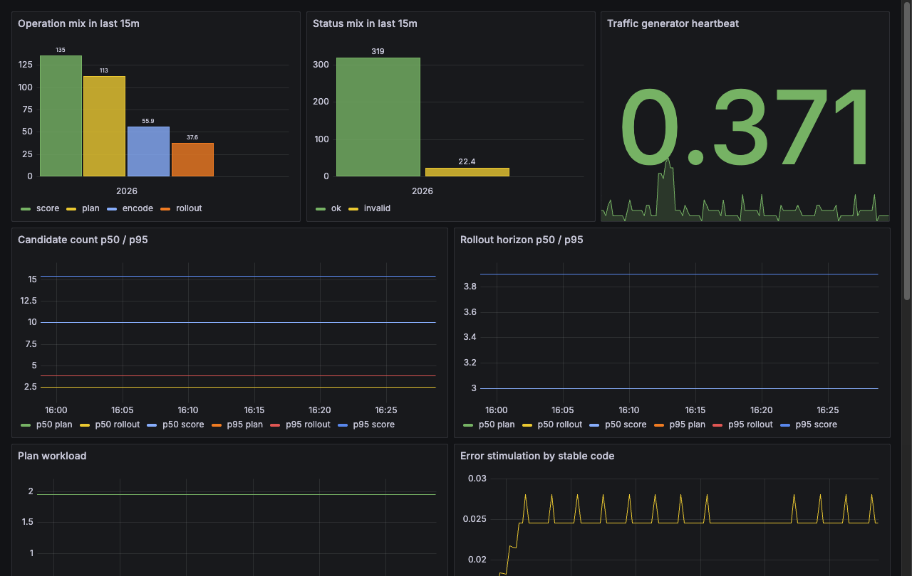

<div align="center">

# Za Warudo

**Serve JEPA world models over WMCP: encode, predict, rollout, score, and plan behind one typed HTTP contract.**

[](https://www.python.org/)
[](https://fastapi.tiangolo.com/)
[](https://pytorch.org/)
[](https://docs.pydantic.dev/)
[](https://opentelemetry.io/)
[](https://prometheus.io/)
[](rfc/0001-wmcp-world-model-inference.md)
[](https://docs.astral.sh/ruff/)
[](https://mypy-lang.org/)
[](#status--scope)

[Quickstart](#quickstart) · [API](#api) · [Backends](#backends) · [Architecture](#architecture) · [Observability](#observability) · [Deploy](#deploy) · [Credits](#credits--references)

</div>

---

**Za Warudo** (`wmcp-jepa-service`) serves JEPA-style, action-conditioned world models over a typed,
[WMCP](rfc/0001-wmcp-world-model-inference.md)-aligned HTTP API. It exposes five operations
(`encode`, `predict`, `rollout`, `score`, `plan`), measures and traces every one, and runs on CPU or
GPU. Two engines sit behind a single `WorldModelBackend` protocol: a deterministic, torch-free
`mock` (the default, with no GPU and no weights) and a real `lewm` runtime that runs vendored
[LeWorldModel](https://huggingface.co/quentinll/lewm-pusht) inference under `torch.inference_mode()`
and plans with an in-process CEM/MPC loop. It serves inference and planning, not training.

Run the whole thing with one command (no Docker, no GPU, no weights):

```bash
make demo-local     # boots the API, runs a score then plan cycle, writes an HTML view
```

<table>
  <tr>
    <td width="50%" align="center" valign="top">
      <a href="docs/assets/img/screenshots/console.png">
        
      </a>
      <br>
      <sub><b>Interactive WMCP console.</b> Compose encode/score/plan calls and watch responses land live.</sub>
    </td>
    <td width="50%" align="center" valign="top">
      <a href="docs/assets/img/screenshots/operations-dashboard.png">
        
      </a>
      <br>
      <sub><b>Operations dashboard (Grafana).</b> Request rate, p50/p95/p99 latency, model compute, planner iterations.</sub>
    </td>
  </tr>
  <tr>
    <td width="50%" align="center" valign="top">
      <a href="docs/assets/img/screenshots/wmcp-request.png">
        
      </a>
      <br>
      <sub><b>Typed WMCP envelope on the wire.</b> Tensors travel as TensorRef (inline / base64 / uri), never raw arrays.</sub>
    </td>
    <td width="50%" align="center" valign="top">
      <a href="docs/assets/img/screenshots/traffic-dashboard.png">
        
      </a>
      <br>
      <sub><b>Traffic stimulator (Grafana).</b> Operation &amp; status mix, candidate count, rollout horizon.</sub>
    </td>
  </tr>
</table>

### What you get

- **One typed contract.** Every request is a Pydantic v2 envelope; every tensor travels as a
  `TensorRef` (`inline` / `base64` / `uri`), never a raw array. The wire shape is mirrored in
  `api/openapi.yaml` and `schemas/*.schema.json`.
- **Swap engines with one env var.** `mock` and `lewm` switch on `WMCP_BACKEND`. Routes, schemas, and
  metrics stay the same.
- **Metrics and traces on every call.** A single `_handle()` path drives 18 Prometheus metric
  families and a full OTel span tree, so latency, error mapping, and trace context stay consistent
  across operations.
- **No GPU or weights to start.** The default `mock` backend needs neither. The real `lewm` path is
  opt-in (CPU or GPU) and loads only from a trusted, checksum-verified package.

## Quickstart

```bash
make demo-local                 # backend + client, end to end (mock, no Docker, no weights)
make demo-local BACKEND=lewm    # the real Push-T checkpoint on CPU (no Docker)
make demo                       # full Compose stack: dashboard + traffic + backend + Prometheus + OTel + Grafana
```

`make demo-local` boots the API, runs a `metadata → score → plan` cycle, and writes an HTML view. No
Docker required. `make demo` brings up the full Docker Compose stack and exposes the interactive
dashboard at **`http://localhost:8088`**, which sends direct WMCP requests, runs batches, starts a
browser-side traffic mix, and reads live Prometheus queries through its proxy. A low-pressure
`traffic-generator` keeps Grafana and the dashboard populated without manual clicks.

> `make demo` runs the **mock** backend by default. If the dashboard shows `backend=mock` /
> `revision=mock`, real checkpoint inference is not running. Use `make demo-lewm` (the Compose stack
> with the real engine) once you've built a model package. `demo-local` is the no-Docker path;
> `demo-lewm` is the full Compose stack.

### Run it by hand

```bash
uv sync --extra dev                 # API + tooling
make run                            # uvicorn on :8080 (mock backend)

curl -s localhost:8080/wmcp/v1/models/lewm-pusht:score \
  -H 'content-type: application/json' -d @examples/score_request.json \
  | jq '.outputs.costs.shape'
# [1, 256]   (costs are [B, S] for score_request.json; best_index varies because the mock costs are synthetic)
```

## Install

```bash
uv sync --extra dev                 # API + tooling (FastAPI, Prometheus, OTel, pytest, ruff, mypy)
uv sync --extra dev --extra lewm    # + the real LeWorldModel backend (torch, torchvision, transformers, einops, safetensors)
```

Requires Python `>=3.10`. `uv.lock` is the source of truth; the Docker image pins `3.10-slim`.

## API

Base path `/wmcp/v1`. Model id is set by `WMCP_MODEL_ID` (default `lewm-pusht`); a request to any
other id returns `404 MODEL_NOT_FOUND`. Every request is a typed `RequestEnvelope`; every success is a
`ResponseEnvelope`; tensors travel as a `TensorRef` (`inline` / `base64` / `uri`), never raw arrays.

| Method · Path | Operation | Output |
|---|---|---|
| `GET  /wmcp/v1/models` · `/wmcp/v1/models/{id}` | metadata | model card, shapes, limits |
| `POST /wmcp/v1/models/{id}:encode` | encode | latents `[B,H,192]` |
| `POST /wmcp/v1/models/{id}:predict` | predict | encode alias (delegates to `encode`) |
| `POST /wmcp/v1/models/{id}:rollout` | rollout | predicted latents `[B,S,T,192]` |
| `POST /wmcp/v1/models/{id}:score` | score | goal-conditioned costs `[B,S]` + `best_index` |
| `POST /wmcp/v1/models/{id}:plan` | plan | CEM/MPC plan `[B,T,10]` + first action `[B,10]` + `best_cost` |
| `GET  /healthz` · `/readyz` · `/metrics` | system | liveness · readiness · Prometheus exposition |
| `POST /v2/models/{name}/infer` | KServe V2 | Open Inference Protocol adapter |

> **`predict`** is a real route and backend method, but both backends implement it by delegating to
> `encode`. The KServe V2 adapter (`/v2/models/{name}/infer`) maps `body.parameters.operation`
> (default `score`) onto a WMCP op and is a **minimal placeholder**. An unsupported op returns
> `400 UNSUPPORTED_OPERATION`.

**Envelopes** (`schemas.py`, Pydantic v2):

- `RequestEnvelope`: `wmcp_version="0.1"`, `request_id`, `operation` ∈ `[metadata, encode, predict, rollout, score, plan]`, `model`, `model_revision?`, `trace`, `inputs`, `parameters`, `return_options`.
- `ResponseEnvelope`: `wmcp_version`, `request_id`, `operation`, `model`, `model_revision?`, `outputs`, `diagnostics`.
- `ErrorEnvelope`: `wmcp_version`, `request_id?`, `error`.
- `TensorRef`: `kind="tensor"`, `encoding` ∈ `{inline, base64, uri}`, `dtype` ∈ `{uint8, float16, float32, float64, int32, int64}`, `shape`, `layout`, optional `data` / `data_b64` / `uri` / `sha256`. A validator enforces `inline→data`, `base64→data_b64`, `uri→uri`.

**Errors** return `{detail: {code, message}}`:

| Code | HTTP | Cause |
|---|---|---|
| `INVALID_ARGUMENT` | 422 | envelope failed Pydantic validation |
| `MODEL_NOT_FOUND` | 404 | request `model` ≠ `WMCP_MODEL_ID` |
| `UNSUPPORTED_OPERATION` | 400 | op not implemented (e.g. KServe adapter) |
| `INTERNAL` | 500 | unhandled compute error (may surface `GPU_OOM` / `TIMEOUT`) |

Request/response fixtures live in [`examples/`](examples/) (`score_request.json`, `rollout_request.json`,
`plan_request.json`, `metadata_response.json`). The canonical contract is
[`api/openapi.yaml`](api/openapi.yaml) plus [`schemas/*.schema.json`](schemas/); treat those as the
source of truth.

## Backends

| `WMCP_BACKEND` | Engine | Needs | Determinism |
|---|---|---|---|
| `mock` *(default)* | torch-free stub with exact output shapes | nothing | deterministic |
| `lewm` | real `quentinll/lewm-pusht` checkpoint, CPU or GPU | `--extra lewm` + a built model package | seeded CEM (`params.seed`) |

The runtime lives behind a `WorldModelBackend` protocol, so the API never changes when the engine
does. The LeWorldModel code is **vendored** (no Hydra/gym/pygame research stack) into
`lewm_model.py` and loads **only** from a trusted, checksum-verified package, never from a request
payload. That is a deliberate security boundary.

What the `lewm` backend actually does:

- **Decodes `TensorRef` inputs**: `inline` / `base64` / `uri` (`file://` and `http(s)://` `.npy`).
- **ImageNet preprocessing**: default `mean=[0.485,0.456,0.406]`, `std=[0.229,0.224,0.225]`,
  `image_size=224`. `uint8` pixels are scaled `/255` then normalized, with `HWC→CHW` when the last dim is 3.
- **Inference under `torch.inference_mode()`**: `model.encode` / `rollout` / `get_cost` on a frozen model.
- **A real CEM/MPC planner.** `plan` samples a Gaussian population (default `candidates=256`), scores
  via `model.get_cost`, keeps the `elite_fraction` (default `0.1`, min 2 elites) for `iterations`
  (default 5), `horizon` default 16. It requires a `goal` input and batch size 1; the population is
  seeded by `params.seed` via a `torch.Generator`.
- **Spills large outputs.** Any output over `100_000` elements is written to the latent store as `.npy`
  and returned by `uri=file://...` (store dir from `WMCP_LATENT_STORE`, default `.artifacts/latents`).

Backend metadata reports `max_batch=8`, `max_candidates=1024`, `max_horizon=64`,
`max_planner_iterations=10`, `dynamic_batching=false`. Latent dimension is **192**; action dimension
is **10**. Default `ModelMetadata`: `model_family="jepa"`,
`model_type="action_conditioned_world_model"`, `task="pusht"`,
`latent_space={dimension: 192, dtype: float32}`.

### Build a real model package

```bash
# build a safetensors package from the HF checkpoint, then serve it
python scripts/build_model_package.py real --source <hf-dir> --out .artifacts/model-package/lewm-pusht
WMCP_BACKEND=lewm WMCP_MODEL_PACKAGE=.artifacts/model-package/lewm-pusht make run
```

A package is a self-describing directory: `manifest.json`, `weights.safetensors`, `preprocessing.json`,
an action scaler, and `checksums.txt`. The loader (`model_package.py`) verifies checksums and tensor
shapes, freezes the model, and runs everything under `torch.inference_mode()`. The author-side builder
(`scripts/build_model_package.py`, subcommands `synthetic` / `real` / `verify`) also produces a
weightless synthetic package for tests and demos.

### Add your own backend

Implement the `WorldModelBackend` protocol (`encode`/`predict`/`rollout`/`score`/`plan`/`metadata`),
load and freeze your model, then register it in `server.py:_make_backend()`. The API, routes, schemas,
and metrics carry over unchanged. See skill `runtime-backend`.

## Architecture

```text
                       ┌──────────────────────────── Za Warudo ────────────────────────────┐
  HTTP request         │                                                                    │
  (RequestEnvelope) ──▶│  FastAPI route  ──▶  _handle(op, model_id, request, backend.<op>)  │
  TensorRef in/out     │      :encode          │  • validate (Pydantic v2)                  │
                       │      :predict         │  • Prometheus metrics + inflight gauge      │
                       │      :rollout         │  • OTel span tree                           │
                       │      :score           │  • error mapping → {detail:{code,message}}  │
                       │      :plan            ▼                                             │
                       │            ┌── WorldModelBackend (Protocol) ──┐                     │
                       │            │   mock  (default, torch-free)    │                     │
                       │            │   lewm  (vendored LeWorldModel)  │── torch.inference_  │
                       │            └──────────────┬───────────────────┘     mode()          │
                       │                           ▼                                         │
                       │              trusted, checksum-verified model package               │
                       │              (manifest · weights.safetensors · preprocessing ·      │
                       │               action scaler · checksums)                            │
                       └──────────────────────────┬─────────────────────────────────────────┘
                                                  │  observability fan-out
                    ┌─────────────────────────────┼──────────────────────────────┐
                    ▼                              ▼                              ▼
              /metrics (Prometheus)        OTLP traces → OTel Collector      structured JSON logs
              scraped by Prometheus        → Tempo → Grafana                 (WMCP_LOG_LEVEL)
```

Span tree per request: `wmcp.request → wmcp.validate → wmcp.preprocess → wmcp.model.{encode,rollout,score,plan} → wmcp.serialize`,
exported over OTLP with W3C `traceparent` propagated from request headers or `trace.traceparent` in
the body. Every operation flows through the single `_handle()` dispatch, which is why metrics, trace
context, and error mapping stay uniform. See [ADR-0001](adr/ADR-0001-inference-engine.md).

## Observability

**Metrics** (`/metrics`, gated by `WMCP_ENABLE_PROMETHEUS`):

| Family | Type | Notes |
|---|---|---|
| `wmcp_requests_total{model,operation,status}` | Counter | request volume by outcome |
| `wmcp_request_latency_seconds{model,operation,status}` | Histogram | end-to-end latency |
| `wmcp_inflight_requests{model,operation}` | Gauge | concurrency |
| `wmcp_request_errors_total{model,operation,code}` | Counter | errors by code |
| `wmcp_validation_latency_seconds{operation}` | Histogram | envelope validation cost |
| `wmcp_serialize_latency_seconds{operation}` | Histogram | response serialization cost |
| `wmcp_model_compute_seconds{model,operation,backend}` | Histogram | the actual compute |
| `wmcp_queue_wait_seconds{model,operation}` | Histogram | *see note below* |
| `wmcp_candidate_count{model,operation}` | Histogram | buckets `1,4,16,64,128,256,512,1024,2048` |
| `wmcp_rollout_horizon{model,operation}` | Histogram | buckets `1..128` |
| `wmcp_batch_size{model,operation}` | Histogram | buckets `1..128` |
| `wmcp_planner_iterations{model,operation}` | Histogram | buckets `1,2,3,5,8,10,15,20,30,50` |
| `wmcp_model_loaded{model,revision,backend}` | Gauge | loaded model marker |
| `wmcp_input_validation_errors_total{operation,code}` | Counter | invalid-input volume |
| `wmcp_service_ready{model,backend}` | Gauge | readiness |
| `wmcp_gpu_available{device}` | Gauge | best-effort on scrape |
| `wmcp_gpu_memory_used_bytes{device}` | Gauge | best-effort on scrape |

> GPU gauges are populated best-effort on each `/metrics` scrape only if torch + CUDA are available;
> the updater never raises. `wmcp_queue_wait_seconds` currently measures validation overhead, not real
> queue wait. It becomes meaningful dynamic-batching queue time once Ray Serve lands (phase 2).

**Traces**: OTel spans exported over OTLP (set `WMCP_OTEL_EXPORTER_OTLP_ENDPOINT`), with W3C
`traceparent` propagation.

`make demo` provisions the full stack:

| Service | URL | What |
|---|---|---|
| Interactive frontend | `http://localhost:8088` | proxies `/api/*` → WMCP service, `/prometheus/*` → Prometheus |
| Grafana | `http://localhost:3000` | dashboards `WMCP LeWM Operations` (19 panels) + `WMCP Traffic Stimulator` (10 panels); anonymous Viewer, `admin`/`admin` |
| Prometheus | `http://localhost:9090` | 15s scrape of the service + OTel Collector |
| Tempo | `http://localhost:3200` | trace store, surfaced in the Operations dashboard's traces panel |

## Benchmark

```bash
make run &
python benchmarks/run_benchmark.py --profile score-medium    # or --all
```

Async load generator across profiles (`smoke` → `score-{small,medium,large}` → `rollout` / `plan`),
reporting p50/p90/p95/p99, throughput, and error rate with full run context. Reports land in
[`benchmarks/reports/`](benchmarks/reports/).

## Configuration

| Env var | Default | |
|---|---|---|
| `WMCP_MODEL_ID` | `lewm-pusht` | served model id |
| `WMCP_BACKEND` | `mock` | `mock` \| `lewm` |
| `WMCP_MODEL_PACKAGE` | `/models/lewm-pusht` | package dir (lewm backend) |
| `WMCP_HF_DEVICE` | `cpu` | `cpu` \| `cuda` |
| `WMCP_LATENT_STORE` | `.artifacts/latents` | where large outputs spill as `.npy` |
| `WMCP_OTEL_EXPORTER_OTLP_ENDPOINT` | unset | OTLP collector endpoint |
| `WMCP_ENABLE_PROMETHEUS` | `true` | gate `/metrics` |
| `WMCP_LOG_LEVEL` | `INFO` | structured JSON log level |

## Deploy

```bash
make demo                   # docker compose: dashboard + traffic + client + backend + monitoring
make demo-lewm              # same stack with the real LeWM backend on CPU
make demo-gpu               # + NVIDIA device reservation
make demo-lewm-stress-test  # real LeWM stack + a concurrent client-side stress tester
make demo-down              # tear the stack down

kubectl apply -f deployment/k8s/deployment.yaml
kubectl apply -f deployment/k8s/kserve-inferenceservice.yaml   # KServe InferenceService (lewm-pusht)
```

The Compose stack (`deployment/docker-compose.yaml`) wires: `wmcp-jepa-service` (`:8080`), a one-shot
`client` demo (writes `demo.html`), a continuous `traffic-generator` (`python -m client.traffic`), the
`dashboard` (`:8088`, nginx), `prometheus` (`:9090`), `otel-collector` (`:4317` gRPC / `:4318` HTTP /
`:8889` exporter), `tempo` (`:3200`), and `grafana` (`:3000`).

> **Heads up: the k8s/KServe manifests are templates, not turnkey.** `deployment/k8s/deployment.yaml`
> uses a placeholder image (`ghcr.io/your-org/...`) and `deployment/k8s/kserve-inferenceservice.yaml`
> references an aspirational `WMCP_BACKEND=ray-pytorch` / `WMCP_MODEL_PACKAGE_URI` that the current
> code does **not** support (supported backends are `mock` | `lewm`; the env var is `WMCP_MODEL_PACKAGE`).
> Treat them as a starting point.

### Stress test

`make demo-lewm-stress-test` layers a `stress-tester` service onto the LeWM stack: many concurrent
workers submit a randomized mix of `score`/`plan`/`rollout`/`encode` with varied tensor shapes and a
slice of intentionally-invalid requests, then print a latency-percentile summary (p50/p90/p95/p99,
throughput, error rate) and exit while the rest of the stack stays up. You can watch it hit the
dashboard (`:8088`) and Grafana (`:3000`) in real time.

Everything is configurable via `WMCP_STRESS_*` env vars (defaults in parentheses); numeric knobs
accept `auto` for a backend-aware default (lighter for the CPU `lewm` backend, heavier for `mock`):

```bash
WMCP_STRESS_CONCURRENCY=16 WMCP_STRESS_DURATION=300 make demo-lewm-stress-test   # heavier, 5 min
WMCP_STRESS_TARGET_RPS=50 WMCP_STRESS_OPS=plan:3,score:1 make demo-lewm-stress-test
```

| Env var | Default | |
|---|---|---|
| `WMCP_STRESS_CONCURRENCY` | `auto` | concurrent workers (`mock` 24 / `lewm` 8) |
| `WMCP_STRESS_DURATION` | `120` | seconds to run (`0` = until `TOTAL`, or forever) |
| `WMCP_STRESS_TOTAL` | `0` | total request cap (`0` = unbounded) |
| `WMCP_STRESS_TARGET_RPS` | `0` | aggregate throttle (`0` = unthrottled) |
| `WMCP_STRESS_OPS` | `score:4,plan:2,rollout:2,encode:1` | weighted operation mix |
| `WMCP_STRESS_INVALID_RATIO` | `0.02` | fraction of intentionally-invalid requests |
| `WMCP_STRESS_{MIN,MAX}_CANDIDATES` · `_HORIZON` · `_ITERATIONS` | `auto` | per-request shape ranges |
| `WMCP_STRESS_RAMP` · `_REPORT_INTERVAL` · `_SEED` · `_TIMEOUT` | `5` · `5` · `11` · `120` | ramp-up, log cadence, RNG seed, request timeout |

You can also run it directly (stdlib only): `python -m client.stress --concurrency 16 --duration 60`
(flags override env). It layers on the mock stack too; add the overlay to a non-LeWM `docker compose up`.

## Develop

```bash
make test                           # pytest (schema-contract tests, runs in <1s)
uv run --extra dev ruff check .     # lint (line length 120)
uv run --extra dev mypy src         # types (zero errors expected)
```

```text
src/wmcp_jepa_service/   server.py · runtime.py · runtime_lewm.py · lewm_model.py
                         model_package.py · packaging.py · request_shape.py · runtime_logging.py
                         schemas.py · observability.py · telemetry.py · __init__.py
client/                  stdlib WMCP client + demo + HTML view + traffic + stress modules
scripts/                 build_model_package.py · pin_sources.py · run_demo_local.sh
deployment/              docker-compose*.yaml · prometheus · otel-collector · tempo · grafana · k8s/
benchmarks/              run_benchmark.py harness + reports/
api/ · schemas/          openapi.yaml + *.schema.json  (GATED: the public WMCP contract)
adr/ · rfc/              architecture & RFC decision records (append-only via PR)
```

Stack: FastAPI · Pydantic v2 · PyTorch · Transformers · prometheus-client · OpenTelemetry · uv.

## Roadmap

- **Dynamic batching.** Ray Serve as the phase-2 serving core (per [ADR-0001](adr/ADR-0001-inference-engine.md)),
  for real `wmcp_queue_wait_seconds`, batched compute, and higher throughput.
- **Golden numerical validation.** Land `tests/test_golden_lewm.py` (cost shape + numerical tolerance
  vs upstream), then enable AMP / `torch.compile` for the `lewm` backend.
- **Real KServe path.** Promote the minimal V2 adapter to a first-class InferenceService and make the
  k8s manifests turnkey.
- **Canonical WMCP fields.** Rename envelope fields onto the upstream WMCP standard once its RFC text
  is final.

## Contributing

Contributions are welcome. `make test`, `ruff check .`, and `mypy src` must pass; commits follow
[Conventional Commits](https://www.conventionalcommits.org/) (`feat(scope): …`, `fix(scope): …`). The
wire contract (`schemas.py`, `api/openapi.yaml`, `schemas/*.schema.json`), `deployment/**`,
`pyproject.toml` dependencies, and `adr/`+`rfc/` records are gated; change them only via PR with
explicit review, and keep the three contract artifacts in lockstep. See [Develop](#develop) for the
local loop and the source-tree map.

## Security

Model weights and model code are never loaded from a request body, only from a trusted,
checksum-verified package on disk. If you find a vulnerability, please report it privately via
[GitHub Security Advisories](https://github.com/AbdelStark/zawarudo/security/advisories) or by
contacting the maintainer, and please keep exploit details out of public issues.

## Status & scope

**v0.1.0.** The API, observability, deployment surface, and a real `LeWMRuntime` are in place, but
this is an early service, not a hardened, production-scale deployment. Read the fine print before you
build on it:

- **WMCP is a working-draft schema.** The upstream WMCP RFC text was not available at design time, so
  field names are designed to refactor into canonical fields once the standard lands. Don't treat the
  current envelope as final.
- **The `mock` backend is the default.** It's the contract-test path and needs no GPU or weights. The
  real `lewm` backend is opt-in and requires the `lewm` extra plus a built model package.
- **No dynamic batching yet.** Ray Serve dynamic batching is phase 2 (ADR-0001); `metadata` reports
  `dynamic_batching=false` and `wmcp_queue_wait_seconds` measures validation overhead, not real queue
  wait. This is not a high-throughput batched serving system today.
- **The `lewm` backend is not yet golden-validated against upstream.** Numerical golden validation
  (`tests/test_golden_lewm.py`) is pending; AMP and `torch.compile` stay off until it passes.
- **The KServe V2 adapter is minimal**, and the k8s/KServe manifests carry placeholder/aspirational
  values (see [Deploy](#deploy)).
- **Weights load only from a trusted, checksum-verified package**, never from a request body (see
  [Security](#security)).

## Credits & references

- **WMCP.** The world-model inference contract this service implements:
  [`rfc/0001-wmcp-world-model-inference.md`](rfc/0001-wmcp-world-model-inference.md) (plus RFCs
  [0002](rfc/0002-action-conditioned-rollout-api.md), [0003](rfc/0003-observability-telemetry.md),
  [0004](rfc/0004-model-packaging-runtime.md), [0005](rfc/0005-pusht-demo-profile.md)). Upstream
  standards effort: [world-modelers/wm-rfcs · WM-RFC-0001](https://github.com/world-modelers/wm-rfcs/blob/main/rfcs/WM-RFC-0001-wmcp.md).
- **Engine decision.** [ADR-0001: inference engine](adr/ADR-0001-inference-engine.md) (Ray Serve +
  FastAPI + PyTorch; runtime behind the `WorldModelBackend` protocol).
- **Checkpoint.** [`quentinll/lewm-pusht`](https://huggingface.co/quentinll/lewm-pusht) (Push-T LeWorldModel).
- **Upstream model code.** [LeWorldModel (`le-wm`)](https://github.com/lucas-maes/le-wm) and
  [`galilai-group/stable-worldmodel`](https://github.com/galilai-group/stable-worldmodel), vendored
  into `lewm_model.py` without the research stack.
- **Repo.** [`github.com/AbdelStark/zawarudo`](https://github.com/AbdelStark/zawarudo).

## License

This project does **not** currently declare a license (no `LICENSE` file, no `pyproject` license
field). The vendored LeWorldModel code and the `quentinll/lewm-pusht` checkpoint are MIT-licensed
upstream ([`galilai-group/stable-worldmodel`](https://github.com/galilai-group/stable-worldmodel)).
Until a project license is added, treat the service code as all-rights-reserved, and open an issue if
you need clarified terms.
