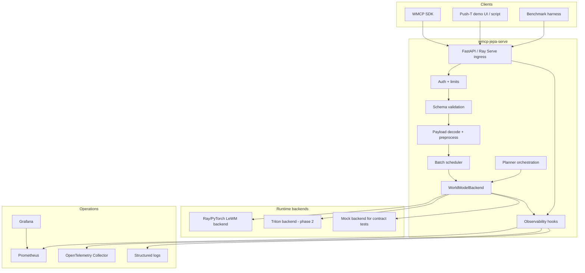

# Technical Specification: WMCP-JEPA Serve

## 1. System overview

`wmcp-jepa-serve` is a model-serving backend for JEPA-style action-conditioned world models. It exposes a stable WMCP-aligned HTTP API and executes model operations through pluggable runtime backends.

The first runtime backend wraps a Push-T LeWorldModel checkpoint. The model receives observation pixels and actions, encodes visual state into latent embeddings, predicts future latent embeddings conditioned on action sequences, scores candidate action sequences against a goal, and optionally runs a planner such as CEM/MPC.

## 2. Architecture



## 3. Runtime abstraction

All model backends implement this conceptual interface:

```python
class WorldModelBackend(Protocol):
    def metadata(self) -> ModelMetadata: ...
    async def encode(self, request: EncodeRequest) -> EncodeResponse: ...
    async def predict(self, request: PredictRequest) -> PredictResponse: ...
    async def rollout(self, request: RolloutRequest) -> RolloutResponse: ...
    async def score(self, request: ScoreRequest) -> ScoreResponse: ...
    async def plan(self, request: PlanRequest) -> PlanResponse: ...
```

`plan` may be implemented in the service layer using repeated `score` calls, or in the backend if a runtime can efficiently execute the full planner.

## 4. Model package

A model package is a directory or OCI artifact containing:

```text
model-package/
├── manifest.json
├── config.json
├── weights.pt or model.safetensors
├── preprocessing.json
├── action_space.json
├── normalizers/
│   ├── action_scaler.json
│   └── observation_stats.json
├── checksums.txt
└── README.md
```

### Required manifest fields

- `model_id`
- `model_family`
- `model_type`
- `source_repository`
- `source_revision`
- `artifact_uri`
- `artifact_revision`
- `artifact_sha256`
- `framework`
- `runtime_class`
- `supported_operations`
- `input_schema`
- `output_schema`
- `preprocessing`
- `action_space`
- `latent_space`
- `limits`
- `observability_labels`

See `schemas/model-manifest.schema.json`.

## 5. Push-T LeWM runtime profile

The first profile is `lewm-pusht`.

| Field | Value / expected value |
|---|---|
| Model family | JEPA / LeWorldModel |
| Task | Push-T manipulation |
| Observation | RGB pixels, target model image size 224x224 |
| History | 3 frames by default from upstream config/runtime |
| Action dimension | 10 from model config |
| Latent dimension | 192 from model config |
| Primary operations | `encode`, `rollout`, `score`, `plan` |
| Initial backend | PyTorch runtime hosted by Ray Serve |

### Important integration note

The model config describes the neural architecture, but a correct planning service also needs the **exact action preprocessing/scaling** used during training/evaluation. Treat action normalizers and bounds as required model package artifacts. Do not infer them from dimension alone.

## 6. API design

### Endpoint summary

| Method | Path | Purpose |
|---|---|---|
| GET | `/healthz` | Liveness. |
| GET | `/readyz` | Model loaded and ready. |
| GET | `/metrics` | Prometheus metrics. |
| GET | `/wmcp/v1/models` | List models. |
| GET | `/wmcp/v1/models/{model_id}` | Model metadata. |
| POST | `/wmcp/v1/models/{model_id}:encode` | Encode observation/goal pixels. |
| POST | `/wmcp/v1/models/{model_id}:predict` | Predict next latent from latent/action context. |
| POST | `/wmcp/v1/models/{model_id}:rollout` | Roll out latent futures for action sequences. |
| POST | `/wmcp/v1/models/{model_id}:score` | Score candidate action sequences against a goal. |
| POST | `/wmcp/v1/models/{model_id}:plan` | Run planner and return selected action sequence. |
| POST | `/v2/models/{model_name}/infer` | Optional KServe V2-compatible adapter. |

### Transport formats

The service should support three payload modes:

1. **Inline JSON arrays** for small tests and conformance examples.
2. **Base64-encoded binary tensors or images** for simple HTTP clients.
3. **URI/object-store references** for production payloads.

Future gRPC support should use binary tensors as the preferred transport.

### Common request envelope

```json
{
  "wmcp_version": "0.1",
  "request_id": "018f2b71-52f4-7710-822c-9fce9c7e9b11",
  "operation": "score",
  "model": "lewm-pusht",
  "model_revision": "hf:quentinll/lewm-pusht:<pinned-revision>",
  "trace": {
    "traceparent": "00-00000000000000000000000000000000-0000000000000000-01"
  },
  "inputs": {},
  "parameters": {},
  "return_options": {
    "include_diagnostics": true,
    "include_latents": false
  }
}
```

### Tensor reference

```json
{
  "kind": "tensor",
  "encoding": "inline",
  "dtype": "float32",
  "shape": [1, 3, 3, 224, 224],
  "layout": "B,T,C,H,W",
  "data": []
}
```

For production, prefer:

```json
{
  "kind": "tensor",
  "encoding": "uri",
  "dtype": "uint8",
  "shape": [1, 3, 224, 224, 3],
  "layout": "B,T,H,W,C",
  "uri": "s3://bucket/request-123/history.npy",
  "sha256": "..."
}
```

## 7. Operation semantics

### 7.1 Encode

Input:

- Observation pixels or goal pixels.
- Optional actions aligned with history.
- Preprocessing mode.

Output:

- Latent embedding tensor or artifact reference.
- Shape metadata.
- Timing diagnostics.

### 7.2 Predict

Input:

- Past embeddings.
- Action embeddings or raw actions.

Output:

- Predicted next embedding(s).

`predict` is mostly an internal operation but is useful for conformance testing and model debugging.

### 7.3 Rollout

Input:

- Observation history.
- Candidate action sequences shaped conceptually as `[batch, candidates, horizon, action_dim]`.
- History size and rollout horizon.

Output:

- Predicted latent trajectories, either inline or as artifact references.
- Optional per-step diagnostics.

### 7.4 Score

Input:

- Observation history.
- Goal observation or goal latent.
- Candidate action sequences.

Output:

- Cost vector shaped `[batch, candidates]`.
- Best candidate index.
- Optional predicted embeddings.
- Cost statistics.

### 7.5 Plan

Input:

- Observation history.
- Goal observation or latent.
- Planner configuration.
- Action bounds/constraints.

Output:

- Best action sequence.
- First action.
- Cost curve.
- Planner diagnostics.
- Optional candidate summary.

Planner parameters:

```json
{
  "planner": "cem",
  "horizon": 16,
  "iterations": 5,
  "candidates": 256,
  "elite_fraction": 0.1,
  "temperature": 1.0,
  "seed": 1234,
  "action_bounds": {
    "low": [-1, -1, -1, -1, -1, -1, -1, -1, -1, -1],
    "high": [1, 1, 1, 1, 1, 1, 1, 1, 1, 1]
  }
}
```

## 8. Validation and limits

All requests must be validated before touching GPU compute.

Required validation:

- `wmcp_version` is supported.
- `model_id` exists and operation is supported.
- Payload encoding is allowed.
- Tensor shape matches declared layout and model limits.
- Dtype is allowed.
- Candidate count and horizon are within configured limits.
- URI scheme is allowed and checksum policy is satisfied.
- Planner timeout is within allowed limits.
- Request size is below max payload limit.

Recommended default limits for demo:

| Limit | Default |
|---|---:|
| Max inline payload | 16 MB |
| Max URI payload | 512 MB |
| Max batch | 8 |
| Max candidates per request | 1024 |
| Max horizon | 64 |
| Max planner iterations | 10 |
| Request timeout | 30 s |
| Plan timeout | 60 s |

## 9. Batching strategy

Batch only requests that are compatible:

- Same model ID and model revision.
- Same operation.
- Same dtype/device mode.
- Same or padded-compatible history/horizon/action dimension.
- Compatible return options.

Batching levels:

1. **Request batching** — combine multiple client requests.
2. **Candidate batching** — flatten candidate dimension into model batch where valid.
3. **Planner batching** — batch CEM candidates internally.

Recommended first implementation:

- Implement candidate batching inside `score` and `rollout`.
- Use Ray Serve dynamic batching for `encode`, `rollout`, and `score` once single-request correctness is verified.
- Do not dynamically batch `plan` at first; plan requests are high-variance and easier to observe in isolation.

## 10. Error model

Return structured WMCP errors:

```json
{
  "error": {
    "code": "INVALID_TENSOR_SHAPE",
    "message": "Expected action_candidates shape [B,S,T,10].",
    "details": {
      "field": "inputs.action_candidates",
      "expected": "[B,S,T,10]",
      "actual": [1, 256, 16, 8]
    },
    "retryable": false
  },
  "request_id": "...",
  "trace_id": "..."
}
```

Error codes:

- `INVALID_ARGUMENT`
- `INVALID_TENSOR_SHAPE`
- `UNSUPPORTED_OPERATION`
- `MODEL_NOT_FOUND`
- `MODEL_NOT_READY`
- `PAYLOAD_TOO_LARGE`
- `URI_NOT_ALLOWED`
- `CHECKSUM_MISMATCH`
- `TIMEOUT`
- `GPU_OOM`
- `INTERNAL`

## 11. Observability specification

### Metrics

Prometheus metric names:

| Metric | Type | Labels | Description |
|---|---|---|---|
| `wmcp_requests_total` | Counter | `model`, `operation`, `status` | Request count. |
| `wmcp_inflight_requests` | Gauge | `model`, `operation` | Requests currently being handled. |
| `wmcp_request_errors_total` | Counter | `model`, `operation`, `code` | Stable error-code counts across validation, HTTP, and internal failures. |
| `wmcp_request_latency_seconds` | Histogram | `model`, `operation`, `status` | End-to-end latency. |
| `wmcp_validation_latency_seconds` | Histogram | `operation` | Validation time. |
| `wmcp_preprocess_latency_seconds` | Histogram | `model`, `operation` | Decode/preprocess time. |
| `wmcp_queue_wait_seconds` | Histogram | `model`, `operation` | Time waiting for batch/replica. |
| `wmcp_model_compute_seconds` | Histogram | `model`, `operation` | GPU/model execution time. |
| `wmcp_serialize_latency_seconds` | Histogram | `operation` | Response serialization time. |
| `wmcp_batch_size` | Histogram | `model`, `operation` | Actual batch sizes. |
| `wmcp_action_candidates` | Histogram | `model`, `operation` | Candidate counts. |
| `wmcp_rollout_horizon` | Histogram | `model`, `operation` | Rollout horizon. |
| `wmcp_planner_iterations` | Histogram | `model`, `planner` | Planner iteration count. |
| `wmcp_model_loaded` | Gauge | `model`, `revision` | 1 if loaded. |
| `wmcp_service_ready` | Gauge | `model`, `backend` | 1 if the backend is loaded and the service is ready. |
| `wmcp_model_load_seconds` | Gauge/Histogram | `model`, `revision` | Load time. |
| `wmcp_input_validation_errors_total` | Counter | `operation`, `code` | Validation errors. |
| `wmcp_gpu_oom_total` | Counter | `model` | OOM events. |

GPU utilization/memory should come from DCGM exporter, NVIDIA tooling, or runtime-specific GPU metrics, then be joined in dashboards by pod/instance.

Metric labels must not include request IDs, user IDs, raw URI paths, or unbounded error strings.

### Tracing

Use W3C `traceparent` propagation. Required spans:

```text
wmcp.request
├── wmcp.auth
├── wmcp.validate
├── wmcp.payload.decode
├── wmcp.preprocess
├── wmcp.scheduler.enqueue
├── wmcp.batch.form
├── wmcp.model.encode_goal
├── wmcp.model.rollout
├── wmcp.model.score
├── wmcp.planner.iteration[N]
└── wmcp.serialize
```

Trace attributes:

- `wmcp.version`
- `wmcp.operation`
- `model.id`
- `model.revision`
- `runtime.backend`
- `tensor.batch`
- `tensor.candidates`
- `tensor.horizon`
- `tensor.action_dim`
- `planner.name`
- `planner.iterations`
- `error.code`

### Logs

Structured JSON log fields:

- `timestamp`
- `level`
- `message`
- `request_id`
- `trace_id`
- `span_id`
- `model_id`
- `model_revision`
- `operation`
- `status_code`
- `latency_ms`
- `candidate_count`
- `horizon`
- `batch_size`
- `error_code`

## 12. Security and supply-chain controls

1. Model artifacts must be pinned by revision and checksum.
2. User requests must never provide arbitrary code or model paths to load.
3. PyTorch pickle-based weights must be loaded only from trusted, pinned build/init artifacts.
4. Prefer conversion to `safetensors` when feasible.
5. Container image must pin Python and dependency versions.
6. Use read-only filesystem for runtime where possible.
7. Restrict outbound network access in production replicas.
8. URI loading must use allowlisted schemes/buckets and enforce checksums for immutable artifacts.
9. Add API auth before any non-local deployment.
10. Enforce payload and planner limits to avoid GPU/CPU denial of service.

## 13. Deployment design

### Local demo

Services:

- `wmcp-jepa-service`
- `prometheus`
- `otel-collector`
- `grafana`
- optional `ray-head` if the service is split from the Ray process

### Kubernetes

Minimum production deployment:

- Deployment with GPU resource requests/limits.
- Service and Ingress.
- Readiness probe on `/readyz`.
- Liveness probe on `/healthz`.
- Prometheus scrape annotation or ServiceMonitor.
- OTel collector sidecar or DaemonSet/central collector.
- ConfigMap for service config.
- Secret for artifact/auth credentials.
- Persistent or init-container model cache.

### KServe option

Once stable, package as a custom KServe runtime:

- Custom container exposing WMCP endpoints and optionally KServe V2 endpoints.
- `ServingRuntime` or `ClusterServingRuntime` for the model format.
- `InferenceService` referencing the model storage URI.
- Autoscaling/canary through KServe.

## 14. Testing strategy

### Unit tests

- Schema parsing and validation.
- Tensor shape/layout checks.
- Error code mapping.
- Metric label generation.
- Planner config validation.

### Golden tests

- Run upstream LeWorldModel evaluation call directly.
- Run service `score` endpoint with same tensors.
- Assert same cost shape and numeric tolerance.
- Assert selected candidate consistency for deterministic seeds.

### Integration tests

- Load model package.
- Health transitions from not ready to ready.
- Score and rollout example requests complete.
- Prometheus exposes expected metrics.
- OTel exporter receives spans.

### Load tests

- Vary candidates: 1, 16, 64, 256, 1024.
- Vary horizon: 1, 4, 8, 16, 32, 64.
- Vary concurrent clients: 1, 4, 16, 64.
- Measure p50/p95/p99, queue wait, batch size, GPU utilization, memory, OOM.

## 15. Implementation plan

### Step 1: Protocol contract

- Finalize JSON schemas and OpenAPI.
- Implement mock backend that returns deterministic tensors.
- Add contract tests against examples.

### Step 2: Checkpoint integration

- Pin upstream repo commits.
- Build model from `config.json`.
- Load checkpoint weights in trusted init/build phase.
- Verify `encode`, `rollout`, and `get_cost` against upstream code.

### Step 3: Real service runtime

- Add `LeWMRuntime` backend.
- Add GPU device selection and warmup.
- Add candidate batching.
- Add error handling and timeout behavior.

### Step 4: Observability

- Add Prometheus metrics.
- Add OTel tracing.
- Add structured JSON logs.
- Add Grafana dashboard.

### Step 5: Demo deployment

- Docker Compose.
- Demo requests.
- Benchmark harness.
- README with exact commands.

### Step 6: Production hardening

- Kubernetes manifests.
- KServe runtime option.
- Authentication.
- Artifact pinning/checksums.
- Canary rollout.

### Step 7: Optimization and research

- Triton backend for stable model ops.
- vLLM plugin/pooling spike.
- Binary/gRPC payload transport.

## 16. Open technical issues

1. Confirm canonical WMCP field names and versioning.
2. Define binary tensor format and artifact URI lifecycle.
3. Decide whether planner state should be stateless per request or session-aware.
4. Decide how to represent continuous action spaces across domains.
5. Decide whether costs should be required to be comparable across models/tasks.
6. Define a conformance test suite for WMCP world-model servers.
7. Confirm exact LeWM preprocessing/action scaling artifacts.
8. Decide how to safely package PyTorch checkpoints from HF into production artifacts.
