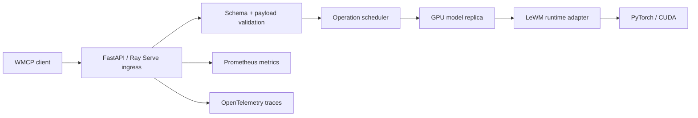

# Research report: inference engines for JEPA-based world models

## Executive recommendation

Use **FastAPI + Ray Serve + PyTorch** as the first serving engine for the Push-T LeWorldModel demo. Use a clean WMCP API gateway around a narrow model-runtime adapter. Add **Triton Inference Server** as the phase-two optimized backend after the model graph and preprocessing boundaries are stabilized. Use **KServe** as the Kubernetes deployment/control-plane integration. Treat **vLLM** as a source of serving design patterns and as a research spike, but not as the MVP runtime.

The core reason is workload shape. The Push-T LeWorldModel checkpoint is not a token generator. It receives image observations and continuous action sequences, creates latent embeddings, autoregressively predicts latent futures, and scores action candidates against a goal latent. That is closer to custom PyTorch model serving plus batched tensor computation than LLM decoding with KV-cache management.

## Workload characteristics

The first target model is `quentinll/lewm-pusht`, a small Push-T LeWorldModel checkpoint. The published config indicates a ViT-tiny image encoder with patch size 14 and image size 224, latent dimension 192, an action encoder with input dimension 10, and an autoregressive predictor configured over 3 frames. The upstream LeWorldModel code exposes methods that map naturally to service operations:

- `encode(info)` — turns pixels and optional action history into embeddings.
- `predict(emb, act_emb)` — predicts future embeddings.
- `rollout(info, action_sequence, history_size=3)` — produces predicted embeddings over candidate action sequences.
- `get_cost(info_dict, action_candidates)` — embeds the goal, rolls out candidates, and returns costs.

This means the service should first wrap these primitives directly and only later optimize the execution graph.

## Evaluation criteria

| Criterion | Why it matters for JEPA world models |
|---|---|
| Custom PyTorch support | Research models often have nonstandard control flow and preprocessing. |
| Dynamic batching | Candidate scoring and encode calls benefit from batching across requests and candidates. |
| GPU utilization | Planning can generate many candidates and repeated rollout calls. |
| Observability | The project explicitly requires production-grade monitoring and latency measurement. |
| Typed API control | WMCP needs explicit observation/action/latent/cost semantics, not generic text prompts. |
| Deployment maturity | Demo should run locally and on Kubernetes with health checks and autoscaling. |
| Model packaging | The checkpoint must include code/config/preprocessing/action scaling, not just weights. |
| Extensibility | Future V-JEPA-style models may be larger and have different inputs. |

## Decision matrix

Scores are relative for this project, not universal quality scores.

| Framework | Fit as MVP runtime | Fit as optimized runtime | Observability | Batching | Notes |
|---|---:|---:|---:|---:|---|
| Ray Serve + FastAPI + PyTorch | 5 | 4 | 4 | 4 | Best first fit for custom model code, dynamic batching, async APIs, and Python integration. |
| Triton Inference Server | 3 | 5 | 5 | 5 | Strong production runtime with dynamic batching, HTTP/gRPC, ensembles, model analyzer. Better after graph boundaries are known. |
| KServe | 4 as deployment layer | 4 | 4 | Runtime-dependent | Not an inference engine; excellent Kubernetes abstraction and V2 protocol/control plane. |
| BentoML | 4 | 3 | 4 | 4 | Good packaging and adaptive batching; less compelling than Ray for distributed planner/runtime control. |
| vLLM | 2 | 2-3 as research spike | 4 | 5 for LLMs | Excellent LLM engine; direct workload mismatch. Plugin/pooling path is possible but not the fastest route. |
| TorchServe | 1 | 1 | 2 | 2 | Not recommended for a new project due limited maintenance/archival status. |
| ONNX Runtime / TensorRT | 2 as full server | 5 as kernel/backend | 2 | N/A | Useful export/optimization target, not the full service/control plane. |

## vLLM assessment

### What can be reused conceptually

vLLM is valuable as a reference design for:

1. **Engine abstraction** — separate API surface from scheduling/model execution.
2. **Continuous batching/backpressure** — queue compatible requests and avoid per-request GPU underutilization.
3. **OpenAI-style model registry conventions** — stable model names, served model aliases, and metadata discovery.
4. **Observability hooks** — latency histograms, model labels, trace export, and detailed performance counters.
5. **Plugin architecture** — custom model/plugin points can inform how WMCP runtimes are extended.

### Why vLLM should not be the MVP runtime

vLLM is optimized for LLM serving: token decoding, KV-cache allocation, PagedAttention, prefix caching, speculative decoding, structured text outputs, and OpenAI-compatible chat/completion/embedding APIs. Its pooling APIs can support non-generation models, and IO Processor plugins can perform pre/postprocessing, but the documented plugin path is currently framed around pooling-style tasks and places validation responsibility on plugin authors. The LeWorldModel workload requires continuous actions, image histories, candidate action tensors, latent rollouts, goal-conditioned cost computation, and planner loops. Forcing those semantics into a text/pooling runtime would create avoidable integration and maintenance risk.

### vLLM research spike proposal

After the Ray Serve MVP is stable, run a bounded spike:

- Implement a vLLM out-of-tree model/plugin that accepts a serialized WMCP rollout/score request through a pooling endpoint.
- Measure overhead, batching behavior, and API impedance mismatch.
- Determine whether vLLM internals can be reused for a generalized tensor-in/tensor-out engine or whether a separate WMCP engine is more appropriate.
- Exit criteria: plugin supports `score` on Push-T with correct outputs and no more than 20% overhead vs native PyTorch/Ray for the same batch shape. If not met, keep vLLM as an architectural reference only.

## Ray Serve assessment

Ray Serve is the recommended MVP runtime because it can host arbitrary Python/PyTorch code, supports async deployments, and provides dynamic request batching. It maps well to this project:

- The API layer can be FastAPI-compatible and explicitly WMCP-shaped.
- A model replica can own GPU memory and a loaded LeWM model.
- Compatible requests can be dynamically batched by operation.
- Planning can be decomposed into candidate generation and batched score calls.
- Metrics are available for request processing latency, requests in progress, errors, batching wait time, batch size, and queue length.
- Ray can later scale out across multiple GPUs or nodes.

Recommended topology:

## Triton assessment

Triton is a strong phase-two backend for production optimization. Its strengths are mature HTTP/gRPC serving, multiple backend formats, dynamic batching, sequence batching, model ensembles, Python backend, custom backend API, and Model Analyzer for latency/throughput/GPU metrics.

Recommended use:

1. Keep WMCP API as the external API.
2. Implement an internal backend interface: `WorldModelBackend`.
3. Start with `PyTorchRayBackend`.
4. Add `TritonBackend` for `encode`/`rollout`/`score` once preprocessing, action normalization, and shape constraints are stable.
5. Use Triton ensembles for preprocess → model → postprocess if the graph can be cleanly separated.
6. Keep planner loops outside Triton unless CEM iteration can be expressed cleanly as an ensemble or custom backend.

## KServe assessment

KServe should be used as the Kubernetes serving abstraction once the container is stable. It gives a standard way to deploy inference services with health checking, autoscaling, traffic splitting/canary releases, and custom runtimes. It also supports the Open Inference Protocol/KServe V2 API shape, which can be adapted alongside WMCP.

Recommendation:

- MVP: plain Kubernetes Deployment + Service for simplicity.
- Production demo: KServe custom runtime or InferenceService once readiness probes, model loading, and `/v2` adapter are implemented.
- Keep WMCP endpoints first-class; expose KServe V2 as compatibility, not as the only protocol.

## BentoML assessment

BentoML is a useful packaging and local-deployment option. It has adaptive batching and Prometheus-compatible metrics. It may be a good alternative if the team wants single-container simplicity over Ray’s distributed runtime. However, for a planner that may need internal fan-out, async coordination, and future multi-replica/multi-GPU scheduling, Ray Serve is a better first production architecture.

## TorchServe assessment

TorchServe should not be selected for a greenfield production service because the official project has entered limited maintenance/archival status. This creates security and long-term maintenance concerns.

## Recommended architecture by phase

| Phase | Runtime | Deployment | Why |
|---|---|---|---|
| P0 mock/service contract | FastAPI only | Local | Validate WMCP schemas quickly. |
| P1 real Push-T demo | Ray Serve + PyTorch | Docker Compose | Fastest path to real custom model serving and batching. |
| P2 production demo | Ray Serve + PyTorch | Kubernetes | Multi-replica, GPU scheduling, OTel/Prometheus. |
| P3 optimized backend | Triton for model ops, Ray/FastAPI for orchestration | KServe/Kubernetes | Mature inference optimization and analysis. |
| P4 research | vLLM plugin/pooling spike | Isolated benchmark | Test whether vLLM can serve non-token world-model workloads. |

## Key implementation findings

1. The service must package not only weights but also preprocessing and action normalization. Push-T action dimension is visible in the model config, but action semantics/scaling must be verified from upstream policy/eval code.
2. `plan` is not a single model forward pass; it is an algorithm over repeated candidate scoring. Treat it as an orchestration endpoint.
3. `rollout` and `score` are the most important benchmark operations because `plan` latency is mostly their repeated use.
4. WMCP should distinguish model outputs (`predicted_emb`, `costs`) from planner outputs (`best_action_sequence`, `first_action`, `iterations`, `elite_costs`).
5. Observability must expose dimensions that explain latency: candidate count, horizon, image preprocessing time, queue wait, batch size, model compute time, and planner iterations.

## Open questions for implementation

1. What is the canonical WMCP field naming and version negotiation scheme?
2. Should WMCP require inline tensors, URI references, binary gRPC payloads, or all three?
3. How should latent embeddings be returned: inline arrays, binary tensors, object-store references, or opaque handles?
4. Should `plan` be part of the core inference protocol or a higher-level tool built on `score`?
5. How should action spaces and normalization be standardized across robotics tasks?
6. What conformance tests should a world-model service pass before it can claim WMCP compatibility?
